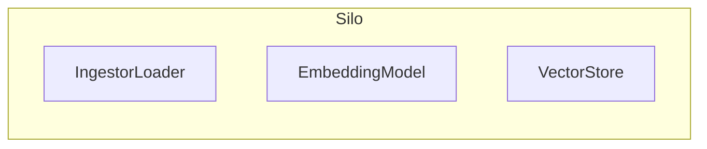
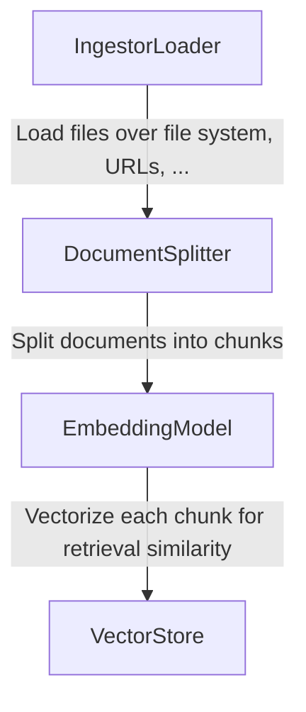
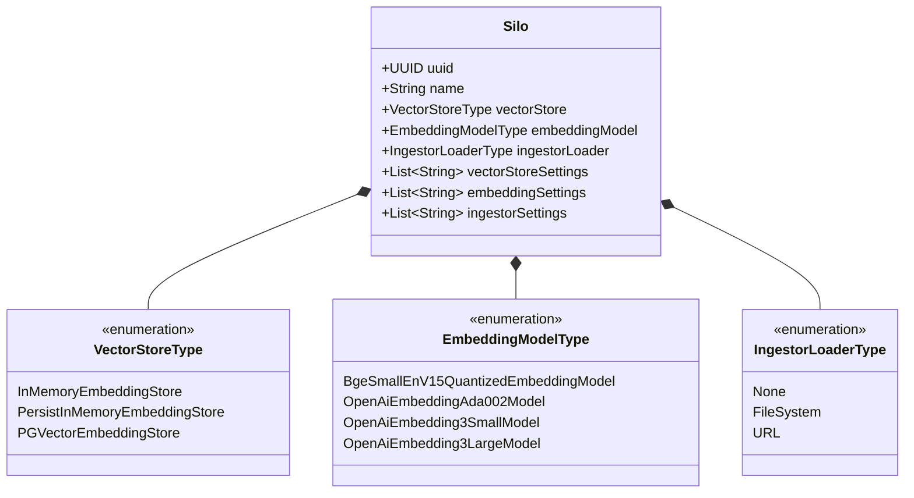
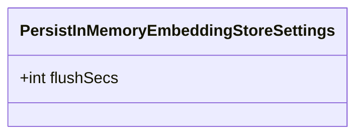
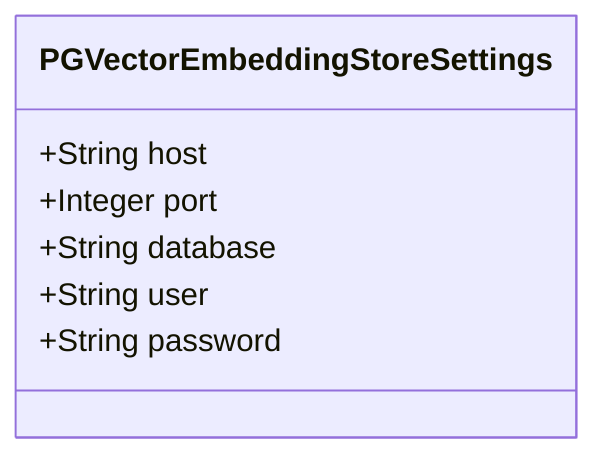
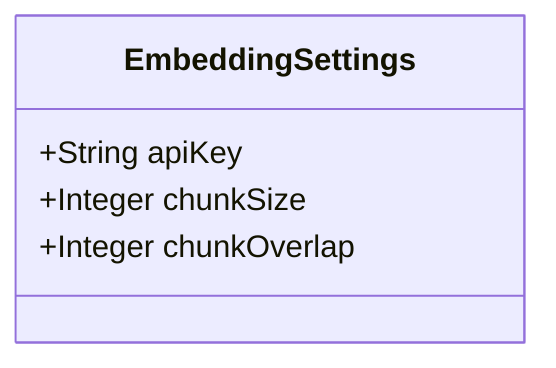
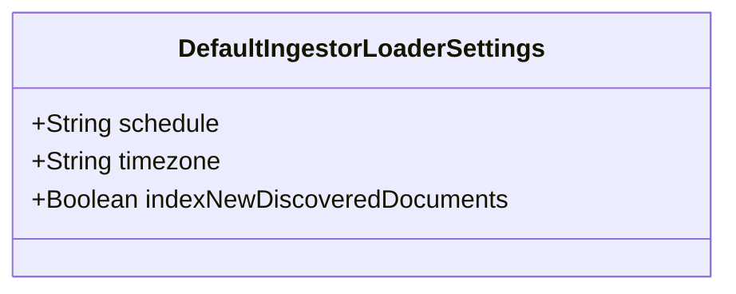

# What's a Silo?

A Silo is composed of three main components :

## How does it work?

The Ingestor Loader is responsible for loading the documents into the Silo : it can be done by reading files in a directory or by providing URLs.&#x20;

After the documents are loaded they are split into chunks (eg. paragraphs, sentences, etc.) by the Silo Splitter.&#x20;

Each chunk is then transformed into a vector by the Embedding Model, which is then stored in the Vector Store for later retrieval.

## Diagrams

### VectorStoreSettings

#### PersistInMemoryEmbeddingStoreSettings

#### PGVectorEmbeddingStoreSettings

### EmbeddingSettings

### IngestorSettings

#### DefaultIngestorLoaderSettings

